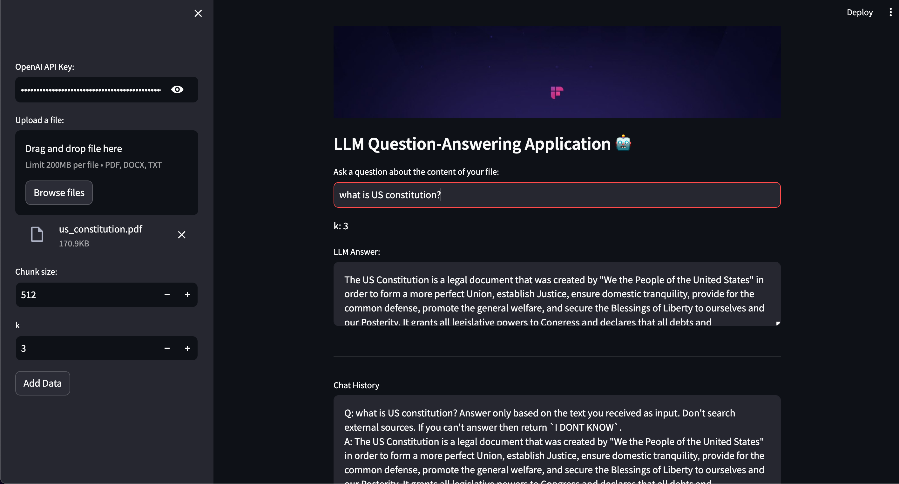

# DocQuery
A RAG-based question-answering app that leverages LangChain, LangChain OpenAI, and Pinecone for efficient document understanding.

Functionality: This app extracts knowledge from your document, stores it intelligently within a Pinecone vector database, and provides accurate answers to your questions.
Key Technologies:
RAG (Retrieval-Augmented Generation): State-of-the-art technique for question answering over structured knowledge.
LangChain: Flexible framework for building AI applications.
LangChain OpenAI: Integration with OpenAI's powerful language models.
Pinecone: Scalable vector database for efficient search and retrieval.
